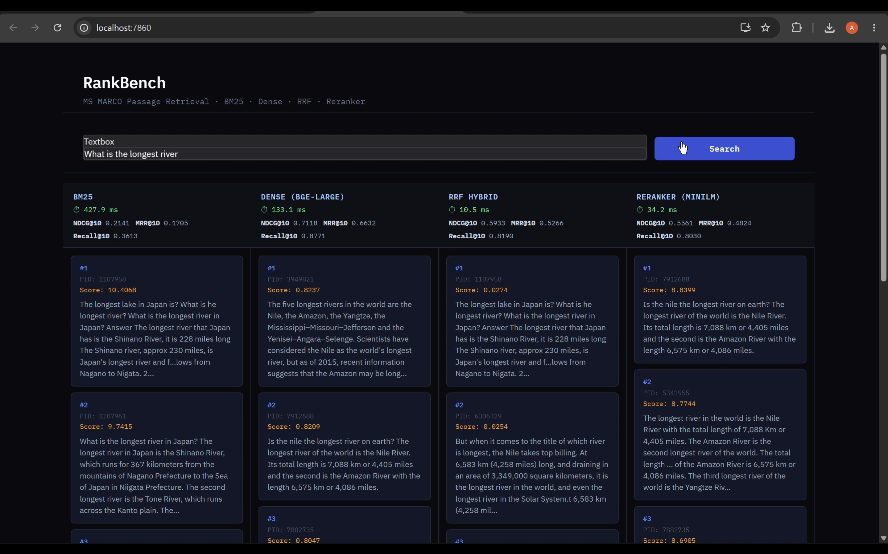
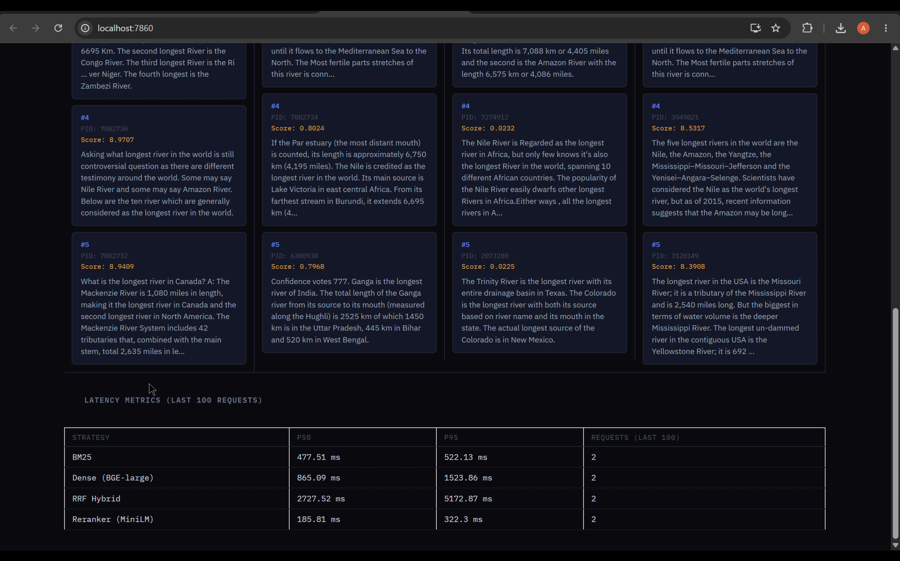

# RankBench

A from-scratch information retrieval benchmark on the MS MARCO Passage corpus, systematically comparing four retrieval strategies — sparse, dense, hybrid fusion, and neural reranking — across standard IR metrics with a live query interface for side-by-side inspection.

**[Demo Video](https://drive.google.com/file/d/1adg2Gtgtj_K7A3T8l1YMlEFPtWOaWBsu/view?usp=sharing)**




---

## Benchmark Results

Evaluated on `msmarco-passage/dev/small` — 6,980 queries, 8.8M passage corpus. Statistical significance tested via `ranx compare()` at p < 0.05.

| Method | NDCG@10 | MRR@10 | Recall@10 | Avg Latency |
|---|---|---|---|---|
| BM25 (bm25s) | 0.2141 | 0.1705 | 0.3613 | 50 ms/q |
| Dense — BGE-large-en-v1.5 | 0.7118 | 0.6632 | 0.8771 | 127 ms/q |
| RRF Hybrid | 0.5933 | 0.5266 | 0.8190 | ~0.67 ms/q |
| Reranker — MiniLM-L-6-v2 | 0.5561 | 0.4824 | 0.8030 | 48 ms/q |

All methods significantly outperform BM25. Dense significantly outperforms RRF and Reranker on all metrics.

### Why does RRF underperform Dense?

This is a corpus coverage artifact, not a pipeline failure. BM25 retrieves from the full 8.8M passage corpus; the dense index covers 1M passages due to encoding time constraints (~15.5 hours for full corpus on available hardware). RRF fuses candidates from both, but since roughly 88% of the corpus is invisible to the dense retriever, fusion degrades rather than improves recall. The cross-encoder reranker then inherits this degraded candidate set — reranking cannot recover relevance that first-stage retrieval failed to surface. Scaling dense retrieval to the full 8.8M corpus would be expected to reverse the RRF and reranker results.

---

## Pipeline Architecture

```
Query
  │
  ├─► BM25                                     top-1000
  │     bm25s · Robertson BM25 · 8.8M passages
  │
  ├─► Dense Retrieval                          top-1000
  │     BGE-large-en-v1.5 · FAISS IndexFlatIP
  │     1M passage subset · cosine similarity
  │
  ├─► RRF Fusion                               top-100
  │     ranx fuse() · min-max normalization
  │     merges BM25 + Dense ranked lists
  │
  └─► Cross-Encoder Reranker                   top-5
        ms-marco-MiniLM-L-6-v2
        scores RRF top-100 · (query, passage) pairs
```

The pipeline is deliberately layered: cheap first-stage retrieval narrows the candidate set, expensive neural scoring runs only on the shortlist. RRF fusion adds ~0.67 ms; the cross-encoder adds ~48 ms — both negligible relative to first-stage retrieval.

---

## Live Interface

The project ships a FastAPI backend and Gradio frontend for interactive side-by-side comparison of all four strategies.

**`POST /query`** — runs all four strategies on a free-text query, returns top-5 results per strategy with per-query latency.

```json
{
  "query": "what causes thunder?",
  "top_k": 5
}
```

**`GET /metrics`** — p50/p95 latency per strategy over a rolling 100-request window.

```json
{
  "bm25":     { "p50": 477.5, "p95": 522.1, "n": 2 },
  "dense":    { "p50": 865.1, "p95": 1523.9, "n": 2 },
  "rrf":      { "p50": 2727.5, "p95": 5172.9, "n": 2 },
  "reranker": { "p50": 185.8, "p95": 322.3, "n": 2 }
}
```

**`GET /health`** — confirms all components (BM25, FAISS, BGE, cross-encoder, corpus) loaded at startup.

---

## Project Structure

```
RankBench/
├── scripts/
│   ├── bm25_baseline.py     # build BM25 index, run full eval
│   ├── encode_dense.py      # encode 1M passages with BGE-large
│   ├── faiss_cpu.py         # build FAISS IndexFlatIP from embeddings
│   ├── query_dense.py       # dense retrieval pipeline + eval
│   ├── rrf.py               # RRF fusion + eval
│   ├── reranker.py          # cross-encoder reranking + eval
│   └── compare.py           # ranx compare() significance tests
├── main.py                  # FastAPI backend
├── app.py                   # Gradio frontend
├── export_corpus.py         # one-time corpus export for API startup
├── requirements.txt
└── README.md
```

---

## Reproducing the Results

### Environment

```bash
conda create -n rankenv python=3.12
conda activate rankenv
# install torch with CUDA before the rest
pip install torch --index-url https://download.pytorch.org/whl/cu124
pip install -r requirements.txt
```

Tested on: Ubuntu · Python 3.12 · torch 2.6 cu124 · GPU for BGE encoding and cross-encoder inference · BM25 CPU-only.

### Step 1 — Build BM25 index and run baseline

```bash
python scripts/bm25_baseline.py
```

Builds `bm25_index/`, saves `results/bm25_run.json` (226 MB). Takes ~10 min on first run.

### Step 2 — Encode passages with BGE-large

```bash
python scripts/encode_dense.py
```

Encodes 1M passages. Saves `embeddings/bge_large_1M.npy` (3.9 GB) and `embeddings/pid_list.npy`. Takes ~1.75 hours on GPU.

### Step 3 — Build FAISS index

```bash
python scripts/faiss_cpu.py
```

Builds `faiss_index/bge_large_1M.index` (3.9 GB) from embeddings. Takes ~4 seconds.

### Step 4 — Run dense retrieval

```bash
python scripts/query_dense.py
```

Saves `results/dense_run.json` (232 MB).

### Step 5 — RRF fusion

```bash
python scripts/rrf.py
```

Fuses BM25 + Dense runs, saves `results/rrf_run.json`.

### Step 6 — Reranker

```bash
python scripts/reranker.py
```

Reranks RRF top-100, saves `results/reranker_run.json`.

### Step 7 — Statistical comparison

```bash
python scripts/compare.py
```

---

## Running the Live Interface

### Prerequisites

The following large files are not tracked in Git and must be generated via the steps above:

| File | Size | Generated by |
|---|---|---|
| `faiss_index/bge_large_1M.index` | 3.9 GB | `faiss_cpu.py` |
| `embeddings/bge_large_1M.npy` | 3.9 GB | `encode_dense.py` |
| `embeddings/pid_list.npy` | 27 MB | `encode_dense.py` |
| `bm25_index/` | ~500 MB | `bm25_baseline.py` |
| `corpus.npy` | ~6 GB | `export_corpus.py` |
| `bm25_index/doc_ids.npy` | ~350 MB | `export_corpus.py` |

### 1. Export corpus (one-time, ~10 min)

```bash
python export_corpus.py
```

### 2. Start the FastAPI backend

```bash
python -m uvicorn main:app --host 127.0.0.1 --port 8000
```

`127.0.0.1` binds to loopback only — the service is not exposed on the network. SSH tunnel is the intended access method (see step 4). Use `python -m uvicorn` rather than bare `uvicorn` to ensure the correct interpreter is used regardless of PATH state.

Wait for `All components loaded. Ready.` in the log before sending queries. Startup loads ~12 GB into memory.

### 3. Start the Gradio frontend

```bash
python app.py
```

### 4. Access the interface

Open `http://localhost:7860` in your browser. If running on a remote server, use SSH local port forwarding — no server ports are opened and no firewall changes are required:

```bash
ssh -L 8000:localhost:8000 -L 7860:localhost:7860 <user>@<server>
```

### 5. Stopping the services

```bash
pkill -f "uvicorn main:app"
pkill -f "app.py"
```

---

## Known Limitations

- Dense index covers 1M of 8.8M passages — full corpus encoding requires ~15.5 GPU-hours. This directly causes RRF and reranker to underperform dense-only retrieval in the current benchmark.
- `corpus.npy` loads the full 8.8M passage texts into RAM (~6 GB). Total API memory footprint at startup is approximately 12 GB.
- `bm25_run.json` and `dense_run.json` exceed GitHub's 100 MB file limit and are excluded from the repository.
- Gradio 6.0 moved the `css` parameter from `gr.Blocks()` to `launch()`. On Gradio ≥ 6.0 a deprecation warning is emitted at startup — this does not affect functionality.